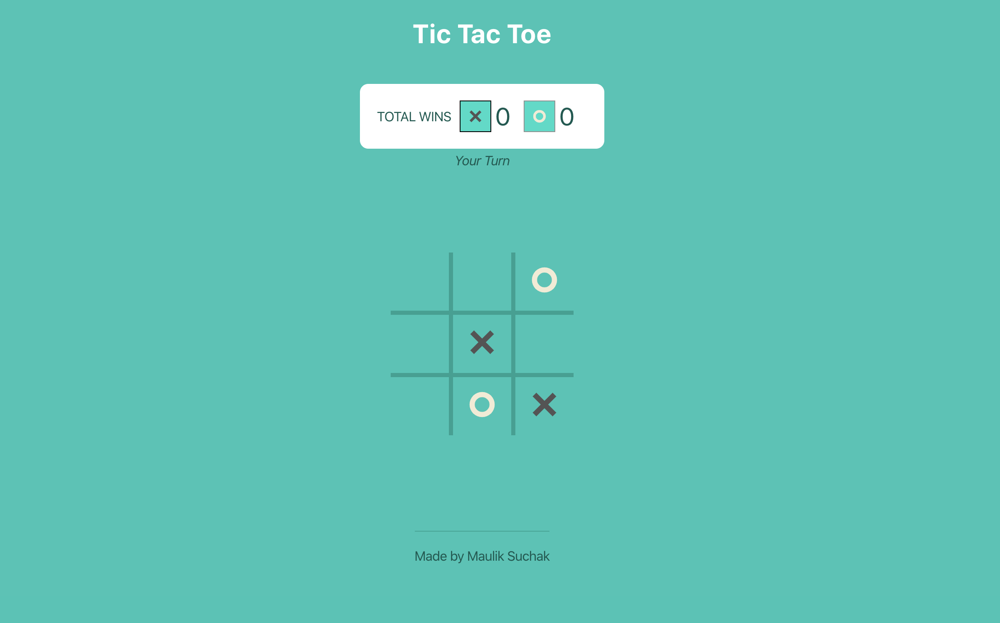

# Tic Tac Toe using React - by Maulik Suchak
* Project: *Tic Tac Toe game*
* Time Taken: *~6hrs*
* Language/Frameworks: *JavaScript(with React) + SCSS*

## Howdy! 👋

Hey there, this is Maulik Suchak. This is my version of Tic Tac Toe




## Features Implemented as MVP

* You can play this against computer.
* Displays the winner in the end in a popup.
* Total wins counter for both Players.
* Ability to make n x n table (TODO: winning logic is only for 3 x 3 right now)


## Possible Enhancements

* [UX] Store "score" in the local storage so it doesn't go back to 0 after browser refresh.
* [UX / Tech] More smarter computer move instead of just letting it randomly choose one 
* [UX] Multi-player realtime (could use Socket.io)
* [Tech] Better SCSS organziation by using mixins, variable, etc.
* [UX / Tech] Graceful degradation to support non-modern browser.


## Setup & Development

### Prerequisite
* Make sure you have `node` installed -- recommended `6.4.1`.
* Once you have a `node` installed, run `npm install` in this repo to get your dependencies.
* (optional) `npm run build` to create build folder.

In the project directory, you can run:

### `npm start`

Runs the app in the development mode.<br />
Open [http://localhost:3000](http://localhost:3000) to view it in the browser.

The page will reload if you make edits.<br />
You will also see any lint errors in the console.

### `npm test`

Launches the test runner in the interactive watch mode.<br />
See the section about [running tests](https://facebook.github.io/create-react-app/docs/running-tests) for more information.

### `npm run build`

Builds the app for production to the `build` folder.<br />
It correctly bundles React in production mode and optimizes the build for the best performance.

The build is minified and the filenames include the hashes.<br />
Your app is ready to be deployed!

See the section about [deployment](https://facebook.github.io/create-react-app/docs/deployment) for more information.

## Technical Details

### Src Structure / Components
```
src
├── index.js
├── App.css
├── App.js
├── Components
|   └── Board
|       ├── Board.scss
|       ├── Cross.jsx
|       ├── ScoreBoard.jsx
|       ├── index.jsx
|       ├── Round.jsx
|   └── Footer
|       ├── Footer.scss
|       ├── index.jsx
|   └── Header
|       ├── Header.scss
|       ├── index.jsx
├── utils
|   └── lib.js
public
├── index.html
```

### Description / Data Flow / Approach
* This project was bootstrapped with [Create React App](https://github.com/facebook/create-react-app). Reason: wanted to move quickly since this structure will give me minimum things I'd need to create a MVP.
* It draws n x n table to begin with.
* Assigns click event to all cells and X (player A) takes the first turn.
* I generate random number of the cell (0 - 8) for computer to make move. This logic has to be updated if we want to finish implementing n x n.
* Tried to use minimal CSS to move quickly. Used SCSS to create better org structure.

### Some Manual Test Cases

Could write following automated unit tests.

*Unit tests*
* Computer makes a move after Player A finishes the move
* Automated next move of computer
* Shows banner when game ends

Thank you!
